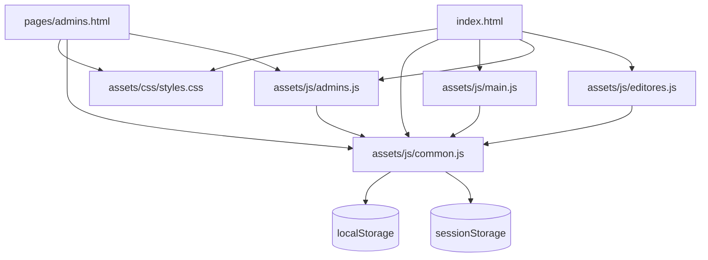

# Arquitectura de Proyecto Mi Mundo Azul

## 1. Resumen

Proyecto Mi Mundo Azul es una aplicación web estática construida con HTML, CSS y JavaScript vanilla. No utiliza un servidor de aplicación, un framework frontend ni un proceso de compilación. El navegador carga los archivos directamente y utiliza `localStorage` y `sessionStorage` como persistencia local para la demo.

La aplicación tiene tres áreas funcionales:

- Sitio público: muestra noticias, información institucional y el acceso al equipo.
- Panel de administración: permite crear y eliminar cuentas editoriales.
- Panel de editores: permite crear borradores, editar noticias, publicarlas y eliminarlas.

## 2. Estructura de carpetas

```text
.
├── index.html                  # Entrada del sitio público
├── pages/                      # Páginas HTML internas
│   ├── admins.html
│   └── editores.html
├── assets/                     # Recursos de la aplicación
│   ├── css/                    # Hojas de estilos
│   │   ├── styles.css          # Estilos globales y compartidos
│   │   ├── admins.css          # Reserva para estilos del panel admin
│   │   └── editores.css        # Reserva para estilos del panel editor
│   ├── images/                 # Recursos gráficos
│   │   └── logo-mi-mundo-azul.jpeg
│   └── js/                     # Lógica de la aplicación
│       ├── common.js           # Estado, persistencia y utilidades comunes
│       ├── main.js             # Sitio público y autenticación
│       ├── admins.js           # Gestión de cuentas editoriales
│       └── editores.js         # Gestión de borradores y noticias
├── docs/                       # Documentación del proyecto
│   ├── architecture.md        # Este documento
│   └── sections/               # Archivos organizativos heredados
└── .vscode/                   # Configuración local del editor
```

## 3. Dependencias entre módulos



`common.js` debe cargarse antes que los módulos que lo utilizan, porque expone las funciones y el objeto `DB` compartidos. Las páginas internas usan rutas relativas con `../assets/` porque están dentro de `pages/`.

## 4. Responsabilidad de cada módulo

### `common.js`

Es la capa común de la aplicación. Contiene:

- Claves y operaciones de `localStorage` para usuarios, noticias y borradores.
- Operaciones de sesión con `sessionStorage`.
- Acceso al DOM mediante `$` y `$$`.
- Formateo de fechas, escape de HTML y generación de identificadores.
- Datos iniciales de demostración.
- Modales, avisos, notificaciones y cambio entre vistas.

### `main.js`

Controla la experiencia pública:

- Renderiza la grilla de noticias.
- Abre la lectura completa de una noticia en una pestaña nueva.
- Gestiona el inicio de sesión.
- Redirige al usuario al panel correspondiente según su rol.

### `admins.js`

Implementa las acciones exclusivas del rol administrador:

- Listado de cuentas con rol `editor`.
- Alta de nuevas cuentas editoriales.
- Eliminación de cuentas existentes.

### `editores.js`

Implementa el flujo editorial:

- Listado de borradores y noticias publicadas.
- Creación y edición de contenido.
- Guardado de borradores.
- Publicación y eliminación de noticias.

### `styles.css`

Contiene los tokens visuales, la tipografía, los componentes compartidos, las vistas públicas y los estilos generales de los paneles. Los archivos `admins.css` y `editores.css` están preparados para separar estilos específicos cuando esos paneles los necesiten.

## 5. Flujo de ejecución

1. El navegador abre `index.html`.
2. Se carga la hoja de estilos global.
3. Se carga `common.js`, que registra las funciones compartidas y prepara el almacenamiento inicial.
4. Se cargan los módulos de público, administración y edición.
5. `main.js` muestra las noticias y deja disponible el inicio de sesión.
6. El usuario inicia sesión y se guarda una sesión temporal en `sessionStorage`.
7. La interfaz cambia de vista según el rol del usuario.
8. Los datos creados o modificados se guardan localmente en `localStorage`.

## 6. Persistencia y alcance

La persistencia actual es local al navegador:

| Dato | Almacenamiento | Clave |
| --- | --- | --- |
| Usuarios | `localStorage` | `mma2_users` |
| Noticias | `localStorage` | `mma2_news` |
| Borradores | `localStorage` | `mma2_drafts` |
| Sesión activa | `sessionStorage` | `mma2_session` |

Este mecanismo es adecuado para una demo o prototipo local, pero no para producción. Las contraseñas se almacenan en el navegador y no existe autenticación contra un servidor, control de permisos real ni sincronización entre dispositivos.

## 7. Convenciones para futuros cambios

- Mantener `index.html` en la raíz para conservar una entrada simple y compatible con hosting estático.
- Colocar nuevas páginas HTML en `pages/`.
- Colocar imágenes, fuentes u otros recursos en `assets/` según su tipo.
- Mantener la lógica compartida en `common.js`; evitar duplicarla en los módulos de cada rol.
- Usar nombres de archivos en minúsculas y separados por guiones cuando sean nombres nuevos.
- Actualizar las rutas relativas cuando un archivo cambie de carpeta.
- Escapar el contenido generado desde datos antes de insertarlo en HTML.
- Si el proyecto evoluciona a producción, reemplazar la persistencia local por una API y un sistema de autenticación seguro.

## 8. Ejecución local

Como no hay proceso de compilación, el proyecto puede servirse con cualquier servidor HTTP estático desde la raíz del repositorio. Por ejemplo:

```bash
python3 -m http.server 8000
```

Luego se puede abrir `http://localhost:8000/` en el navegador.
